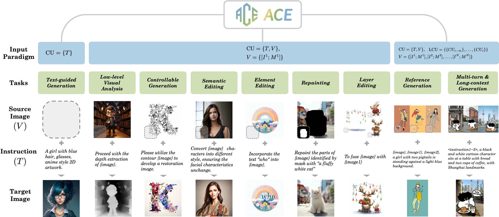

<p align="center">

  <h2 align="center"> : All-round Creator and Editor Following Instructions via Diffusion Transformer</h2>

  <p align="center">
    <a href="https://arxiv.org/abs/2410.00086"></a>
    <a href='https://ali-vilab.github.io/ace-page'></a>
    <a href=''></a>
    <a href='https://github.com/modelscope/scepter'></a>
    <br>
    <strong>Zhen Han*</strong>
    ·
    <strong>Zeyinzi Jiang*</strong>
    ·
    <strong>Yulin Pan*</strong>
    ·
    <strong>Jingfeng Zhang*</strong>
    ·
    <strong>Chaojie Mao*</strong>
    <br>
    <strong>Chenwei Xie</strong>
    ·
    <strong>Yu Liu</strong>
    ·
    <strong>Jingren Zhou</strong>
    <br>
    Tongyi Lab, Alibaba Group
  </p>
  <table align="center">
    <tr>
    <td>
      
    </td>
    </tr>
  </table>

## 📢 News
* **[2024.9.30]** Release the paper of ACE on arxiv.
* **[2023.10.31]** Release the ACE checkpoint on [ModelScope](https://www.modelscope.cn/models/iic/ACE-0.6B-512px) and [HuggingFace](https://huggingface.co/scepter-studio/ACE-0.6B-512px).
* **[2023.11.1]** Support online demo on [HuggingFace](https://huggingface.co/spaces/scepter-studio/ACE-Chat).


## 🚀 Installation
Install the necessary packages with `pip`: 
```bash
pip install -r requirements.txt
```


## 🔥 Training

We offer a demonstration training YAML that enables the end-to-end training of ACE using a toy dataset. For a comprehensive overview of the hyperparameter configurations, please consult `config/ace_0.6b_512_train.yaml`.

### Prepare datasets

Please find the dataset class located in `modules/data/dataset/dataset.py`, 
designed to facilitate end-to-end training using an open-source toy dataset. 
Download a dataset zip file from [modelscope](https://www.modelscope.cn/models/iic/scepter/resolve/master/datasets/hed_pair.zip), and then extract its contents into the `cache/datasets/` directory.

Should you wish to prepare your own datasets, we recommend consulting `modules/data/dataset/dataset.py` for detailed guidance on the required data format.

### Prepare initial weight
The ACE checkpoint has been uploaded to both ModelScope and HuggingFace platforms:
* [ModelScope](https://www.modelscope.cn/models/iic/ACE-0.6B-512px)
* [HuggingFace](https://huggingface.co/scepter-studio/ACE-0.6B-512px)

In the provided training YAML configuration, we have designated the Modelscope URL as the default checkpoint URL. Should you wish to transition to Hugging Face, you can effortlessly achieve this by modifying the PRETRAINED_MODEL value within the YAML file (replace the prefix "ms://iic" to "hf://scepter-studio").


### Start training

You can easily start training procedure by executing the following command:
```bash
PYTHONPATH=. python tools/run_train.py --cfg config/ace_0.6b_512_train.yaml
```

## 💬 Chat Bot 
We have developed an chatbot UI utilizing Gradio, designed to transform user input in natural language into visually stunning images that align semantically with the provided instructions. Users can effortlessly initiate the chatbot app by executing the following command:
```bash
PYTHONPATH=. python chatbot/run_gradio.py --cfg chatbot/config/chatbot_ui.yaml
```

<table align="center">
  <tr>
  <td>
    <video height="600" controls>
      <source src="assets/videos/demo_chat.mp4" type="video/mp4">
    </video>
  </td>
  </tr>
</table>


## 📝 Citation

```bibtex
@article{han2024ace,
  title={ACE: All-round Creator and Editor Following Instructions via Diffusion Transformer},
  author={Han, Zhen and Jiang, Zeyinzi and Pan, Yulin and Zhang, Jingfeng and Mao, Chaojie and Xie, Chenwei and Liu, Yu and Zhou, Jingren},
  journal={arXiv preprint arXiv:2410.00086},
  year={2024}
}
```